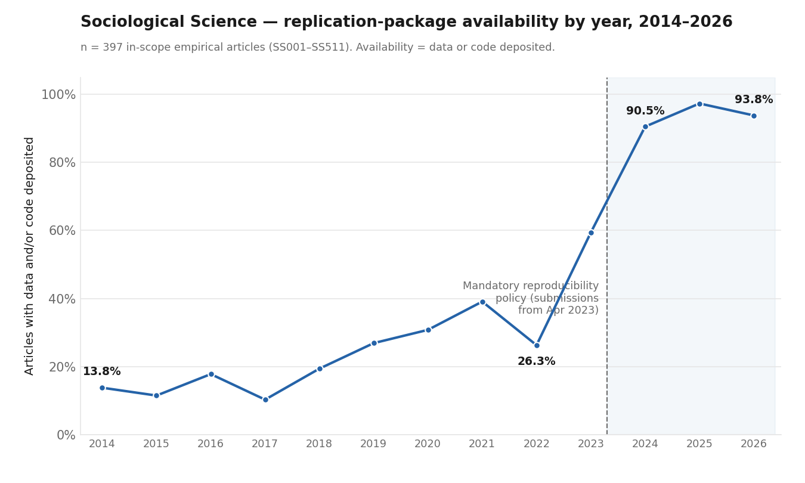

# Sociological Science — Replication-Package Availability (2014–2026)

A complete, DOI-keyed dataset recording **whether every research article published in
*Sociological Science* deposited its data and/or code**, together with the multi-agent
pipeline, codebook, and provenance used to produce it.

**413 articles** (SS001–SS511), the journal's full run from its 2014 founding through
August 2026 (volumes 1–13).

---

## Description

Each in-scope empirical article is coded for whether the authors deposited an
analysis **dataset** and/or **code**, where the package lives (the exact repository link),
and — when the underlying data is access-restricted — how to apply for it. The headline
finding is the effect of the journal's mandatory-reproducibility policy (packages required for
manuscripts submitted on or after **2023-04-01**):

| Manuscripts submitted | n | Availability (data and/or code deposited) |
|-----------------------|---|--------------------------------------------|
| **Before** 2023-04-01 | 278 | **22.7%** |
| **On/after** 2023-04-01 | 119 | **95.0%** |



Whole-corpus availability is 176 / 397 = 44.3% (held down by the pre-policy decade).

---

## Table of Contents

- [Description](#description)
- [Repository structure](#repository-structure)
- [The dataset](#the-dataset)
- [Usage](#usage)
- [Methodology & quality control](#methodology--quality-control)
- [Reproducibility](#reproducibility)
- [Citation](#citation)
- [License](#license)
- [Contributions](#contributions)
- [Contact](#contact)

---

## Repository structure

```
socsci-replication-availability/
├── README.md
├── LICENSE                      # MIT (code) + CC BY 4.0 (data)
├── agent.toml                   # the six-agent specification (references skills/)
├── skills/                      # source-based search skills the agents load
│   ├── osf-repository/ · data-repository/ · github-repository-and-pages/
│   ├── journal-reproducibility-package/ · article-pdf-availability-statement/
│   ├── author-homepage/ · project-or-lab-site/ · google-scholar-profile/
│   ├── calibration-honesty/               # honesty/uncertainty discipline
│   └── _verdict/                          # the coding verdicts (both-available, data-only, …)
├── data/
│   ├── socsci_all_v3.xlsx       # the full dataset (413 rows)
│   ├── socsci_all_v3.csv        # same, CSV
│   └── availability_by_year.png # the chart above
├── docs/
│   ├── codebook.md              # coding manual (v3.2) — field definitions & rules
│   └── run_provenance.md        # pinned run parameters (model, prompts, workflow)
└── pipeline/
    ├── six-agent-availability.js  # main pipeline: Scope→Locate→Verify→Execute→Verify
    ├── gated_recheck.js           # data_gated determiner (codebook v3.2)
    ├── gated_determination.js     # data_gated determiner (initial variant)
    ├── write_v3.py                # write pipeline output into the v3 schema
    ├── write_inplace.py           # fill coding into an existing v3 table
    └── merge_all.py               # merge per-batch tables into the full dataset
```

---

## The dataset

One row per article. Columns (full definitions in [`docs/codebook.md`](docs/codebook.md)):

**Block A — bibliographic:** `doi` (primary key), `paper_id`, `title`, `authors`,
`published_date`, `submission_date`, `article_url`.

**Block B — availability coding:**
`in_scope` (Y / NA / ?), `qualitative`, `data`, `code`, `data_and_code`, `neither`,
`data_gated`, `data_source_apply_at`, `package_location`, `path_to_package`,
`coverage_checked`, `notes`.

Key definitions:
- **`in_scope` = Y** — original empirical analysis by the authors (a qualitative empirical paper is Y).
- **`data` = Y** — the authors deposited their analysis dataset (a pointer to a public source is *not* a deposit).
- **`code` = Y** — the authors deposited code that reproduces this paper's results.
- **`data_gated` = Y** — the underlying data is not freely/publicly available (restricted / confidential / proprietary / register / IRB); `data_source_apply_at` records how to obtain it.
- **`package_location`** — the actual deposit repository link (OSF / Harvard Dataverse / GitHub / Zenodo / ICPSR …).

---

## Usage

**Look up one article** — open `data/socsci_all_v3.csv`, filter by `doi`, and read
`data` / `code` / `package_location` to find and download its replication package.

**Analyse the corpus** (Python):

```python
import pandas as pd
df = pd.read_csv("data/socsci_all_v3.csv")
insc = df[df.in_scope == "Y"]
avail = insc[(insc.data == "Y") | (insc.code == "Y")]
print(len(avail) / len(insc))   # overall availability rate
```

**Re-run the coding pipeline.** The pipeline runs as a multi-agent workflow (see
`pipeline/six-agent-availability.js` and `agent.toml`); parameters are pinned in
[`docs/run_provenance.md`](docs/run_provenance.md). `pipeline/*.py` are the plain-Python
writers/mergers and run with `openpyxl`:

```bash
python3 pipeline/merge_all.py     # rebuild data/socsci_all_v3.xlsx from per-batch tables
```

---

## Methodology & quality control

Each article passes through a five-stage multi-agent pipeline —
**Scope → Locate → Verify → Execute → Verify** — that classifies scope, searches every deposit
channel (journal supplemental tab, article-PDF end-matter, supplement PDF, and repository APIs:
OSF, Harvard Dataverse, GitHub, Zenodo, ICPSR …), and records what was actually inside the
package. A separate determiner then decides `data_gated` and the application route for every
in-scope paper, under the codebook v3.2 rule.

Quality control:
- **Independent verification** — every positive finding is re-checked by a verifier agent for
  provenance (the repository belongs to these authors and reproduces *this* paper); every
  not-found result is re-checked by a second coverage agent — before it is recorded.
- **Manual sampling** — a random sample from each batch was checked by hand and confirmed.
- **Full-text re-reads** — borderline scope / gated calls were resolved by reading the full PDF.
- **No silent failures** — degraded or interrupted rows are skipped and re-run, never recorded
  as findings.

---

## Reproducibility

All runs use **pinned parameters** — model, prompt version, and workflow spec are frozen and
documented in [`docs/run_provenance.md`](docs/run_provenance.md), against the written
[`docs/codebook.md`](docs/codebook.md). The dataset is keyed by **DOI** and records each
article's exact **`package_location`**, so any package can be located, downloaded, and tested
directly from the table.

---

## Citation

> Li, Borun (2026). *Replication-Package Availability in Sociological Science, 2014–2026.*
> [Dataset & pipeline]. GitHub repository.

(A citable DOI will be minted when the dataset is deposited on Zenodo/OSF.)

---

## License

- **Code** (`pipeline/`, `agent.toml`): [MIT](LICENSE).
- **Dataset** (`data/`): [CC BY 4.0](https://creativecommons.org/licenses/by/4.0/) — reuse
  freely with attribution (see Citation).

---

## Contributions

Issues and pull requests are welcome — for corrections to individual codings, coverage of newly
published articles, or extensions to other journals. Please:

1. Open an issue describing the article (`doi`) and the proposed change, with evidence
   (the repository link or the article's data-availability statement).
2. For a coding change, keep the codebook v3.2 rules (see `docs/codebook.md`); note which rule applies.
3. A companion **American Sociological Review (ASR)** adapter is planned, coding ASR under the
   **same codebook** so the two journals are directly comparable.

---

## Contact

Borun Li — borun.li@icloud.com
